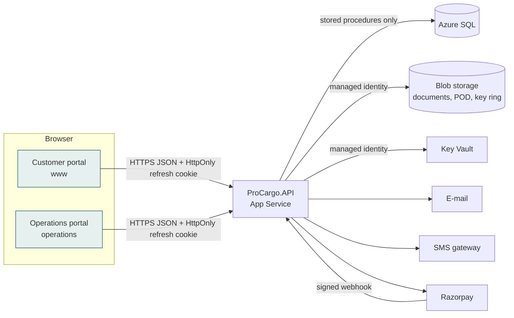

# Architecture

ProCargo is a road-freight platform for India: customers book loads, ProCargo prices and quotes them, assigns a
partner's truck and driver, tracks the trip with OTP-verified pickup and delivery, invoices the customer and settles
the freight (less commission) with the truck owner.

## Solutions

Three independent solutions that share only the HTTP API contract, each with its own pipeline:

| Solution | Path | Contents |
| --- | --- | --- |
| `ProCargo.API.sln` | `Backend/` | ASP.NET Core 10 Web API, clean architecture, unit + integration tests |
| `ProCargo.UI.sln` | `CustomerPortal/` | React app: public website, customer, owner and driver portals |
| `ProCargo.Operations.sln` | `OperationsPortal/` | React app for staff (operations, finance, support, admin) |
| Database project | `Database/ProCargo.Database` | Idempotent T-SQL: schemas, tables, procedures, seed and test data |



## Backend layers

```
ProCargo.Domain          entities' enums, status transition rules, pricing calculator, Indian format rules (no dependencies)
ProCargo.Application     services (use cases), DTOs, requests + FluentValidation, interfaces for repositories and providers
ProCargo.Infrastructure  EF Core stored-procedure executor, repositories, security, storage, messaging, payments, jobs
ProCargo.API             controllers, authorization, middleware, filters, rate limiting, Swagger, health checks
```

Dependencies point inwards only. Controllers are thin: they bind and validate requests, call one service method and
return its DTO. Services own every business rule (state transitions, access checks, audit, notifications);
repositories only map procedure parameters and results.

### Data access

* EF Core is used as a connection and mapping layer only: `Database.SqlQuery<T>` and `ExecuteSqlInterpolatedAsync`
  against stored procedures (`StoredProcedureExecutor`). There is no `DbSet` access to tables, no LINQ-to-SQL and no
  migrations; the schema is owned by the database project.
* Every procedure parameter is passed as a typed `SqlParameter`, so there is no string-built SQL anywhere.
* Business errors raised in SQL use `THROW 504xx` and are translated by `SqlErrorTranslator`: 50400 → 422 business
  rule, 50403 → 403, 50404 → 404, 50409 → 409 conflict, 50412 → 409 stale `rowversion`; unique-key violations
  become 409 and foreign-key violations 422.
* Optimistic concurrency: updatable aggregates carry a `rowversion` that the client sends back.

### Request pipeline

`ExceptionHandling` → `SecurityHeaders` → HTTPS redirection → CORS → rate limiter → authentication →
`PasswordChangeRequired` → authorization → controllers (`ValidationFilter` runs FluentValidation for every bound
argument). Errors always come back in one JSON shape (see [API](../API/README.md)).

### Cross-cutting decisions

| Concern | Decision |
| --- | --- |
| Time | Stored and transported in UTC; displayed in IST (UTC+05:30, no DST) in both portals and in e-mails |
| Money | `decimal(18,2)` in SQL and C#; GST computed on the server only; amounts in INR |
| Identifiers | Surrogate `bigint` keys; human numbers from sequences (`PC-BKG-2026-000123`, `PC-TRP-…`, `PC-INV-…`) |
| Logging | Serilog to console (Application Insights in Azure); request logging with trace id; secrets never logged |
| Audit | `aud.AuditLog` via `IAuditLogger`, before/after JSON with secret-like fields masked |
| Files | Private blob container; files streamed through the API after an authorization check, never public URLs |
| Sensitive fields | Bank account numbers and PAN encrypted with ASP.NET Core Data Protection (keys in Blob, wrapped by Key Vault) |
| Background work | Hosted services: quotation expiry, first Super Admin bootstrap |
| Health | `/health` (liveness) and `/health/ready` (SQL reachable) |
