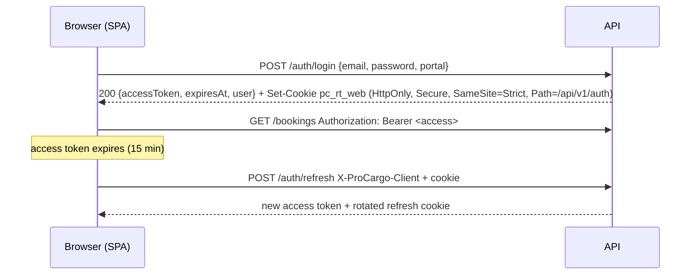

# Authentication

## Accounts and portals

One `sec.User` table holds every account. `IsInternal` separates staff from customers, truck owners and drivers.
Each sign-in names a portal:

| Portal | Application | Who may sign in | JWT audience | Refresh lifetime |
| --- | --- | --- | --- | --- |
| `Web` | Customer portal | external accounts only | `procargo-web` | 14 days (`Jwt:WebRefreshTokenDays`) |
| `Operations` | Operations portal | staff with `AccessOperationsPortal` | `procargo-operations` | 12 hours (`Jwt:OperationsRefreshTokenHours`) |

A staff account cannot sign in to the customer portal and vice versa; a token minted for one audience is rejected by
every endpoint of the other (the `Staff` / `External` policies check the `portal` claim as well).

## Tokens

* **Access token**: JWT signed with HMAC-SHA256 (`Jwt:SigningKey`, 64 random bytes from Key Vault), 15 minutes,
  claims `sub`, `email`, `name`, `portal`, `role`, `perm` (one per permission), `mcp` when a password change is
  required. It is kept in memory by the SPA only, never in `localStorage`.
* **Refresh token**: 256-bit random value in an HttpOnly cookie (`pc_rt_web` / `pc_rt_ops`) the page script cannot
  read; only its SHA-256 hash is stored. Every refresh **rotates** it. Presenting an already-rotated token is treated
  as theft: the whole token family (that sign-in session) is revoked and the event audited.
* `refresh` and `logout` require the `X-ProCargo-Client` header, which a cross-site form cannot send, on top of
  `SameSite=Strict`. CORS allows only the two portal origins, with credentials.
* The SPAs refresh single-flight: concurrent 401s wait for one refresh call, then retry once.
* Logout revokes the presented refresh token and deletes the cookie. Deactivating a user or changing their password
  revokes all of their refresh tokens.

## Passwords

* At least 8 characters with upper case, lower case, digit and symbol; validated in the API and in the forms.
* Hashed with ASP.NET Core Identity's `PasswordHasher` (PBKDF2-HMAC-SHA512, 100 000 iterations, per-password salt).
* 5 failed attempts lock the account for 15 minutes (`Security:MaxFailedLoginAttempts`, `LockoutMinutes`); an
  administrator can unlock early. Every attempt is written to `sec.LoginHistory`.
* Sign-in failures use one message for unknown e-mail, wrong password and locked account, so accounts cannot be
  enumerated; `forgot-password` always answers the same way.
* **Reset**: a single-use random token (only its hash is stored), valid 30 minutes, e-mailed as a link to the right
  portal. Staff invitations use the same mechanism with a 24-hour token, and new staff must change the password at
  first sign-in (`mcp` claim; every other endpoint answers 403 `PASSWORD_CHANGE_REQUIRED` until they do).

## Trip OTPs

Pickup and delivery are confirmed with six-digit OTPs sent by SMS to the consignor and consignee contacts on the
booking. OTPs come from a CSPRNG; only `HMAC-SHA256(Security:OtpHashingKey, tripId:type:otp)` is stored, with an
expiry (default 10 minutes) and an attempt limit (default 5), compared in constant time. Resend is throttled
(`Security:OtpResendSeconds`) and the endpoints have their own rate limit.

`Security:ExposeOtpForTesting` returns the OTP in the API response so the flow can be tested without SMS; the API
refuses to start if it is enabled in Production.

## First administrator

`Bootstrap:SuperAdminEmail` and `Bootstrap:SuperAdminPassword` (app settings, never committed) create the first
Super Admin at start-up if no account with that e-mail exists. The account must change its password at first sign-in;
remove both settings afterwards.
